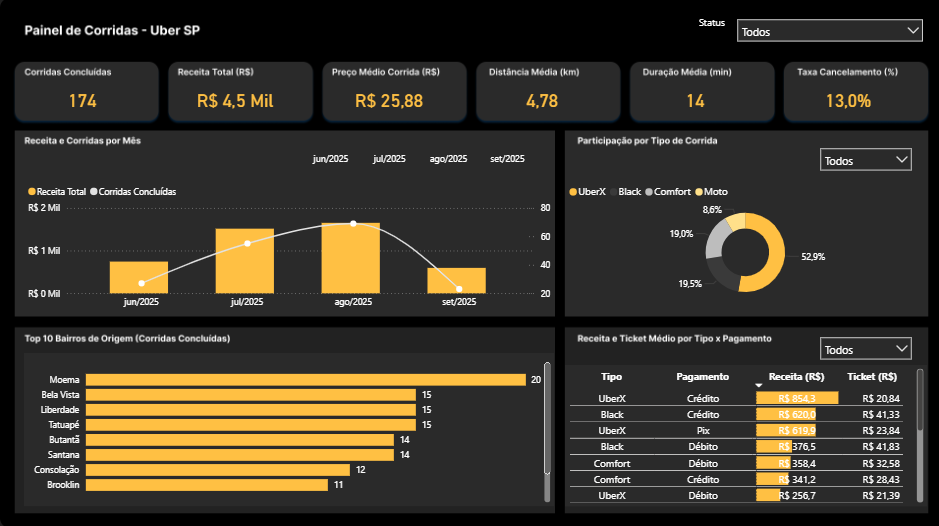

# Dashboard – Análise da Uber (SP)

> Base **fictícia** para estudo. Período analisado: **jun–set/2025**.

## Destaques do período
- **174 corridas concluídas**
- ** R$ 4,5 mil** de receita
- **Ticket médio:** **R$ 25,88**
- **Distância média:** **4,78 km**  |  **Duração média:** **14 min**  → ~**20,5 km/h**
- **Taxa de cancelamento (global):** **13,0%**

## O que os dados mostram
- **Agosto** foi o mês mais forte em volume e receita; **setembro** caiu um pouco.
- **UberX** concentra cerca de **metade** das viagens. **Comfort** e **Black** ficam por volta de **20%** cada; **Moto** tem participação pequena.
- Em preço, **Black** se destaca com **ticket ~R$ 39**, acima das demais categorias.
- **Bairros de origem** mais frequentes: **Moema**, **Bela Vista** e **Liberdade**.
- Em **pagamento**, **cartão** aparece com bons valores de receita e ticket.

## Ideias para testar (hipóteses)
- Reforçar **motoristas nos bairros líderes** nos horários de pico (menos espera, menos cancelamento).
- **Sugerir categoria superior** (ex.: de UberX para Comfort/Black) quando a diferença de preço for pequena e a espera estiver favorável.
- Abrir **cancelamentos por horário** e **tempo de espera** para metas de redução por faixa.
- Acompanhar **mês a mês** o que muda por **quantidade de viagens** e o que muda por **preço**.

## Dados
- Base (XLSX): [uber_rides_base.xlsx](uber_rides_base.xlsx)

> Este repositório guarda apenas a **imagem** do painel e esta **análise** descritiva.  
> Não há arquivo do Power BI para download.
